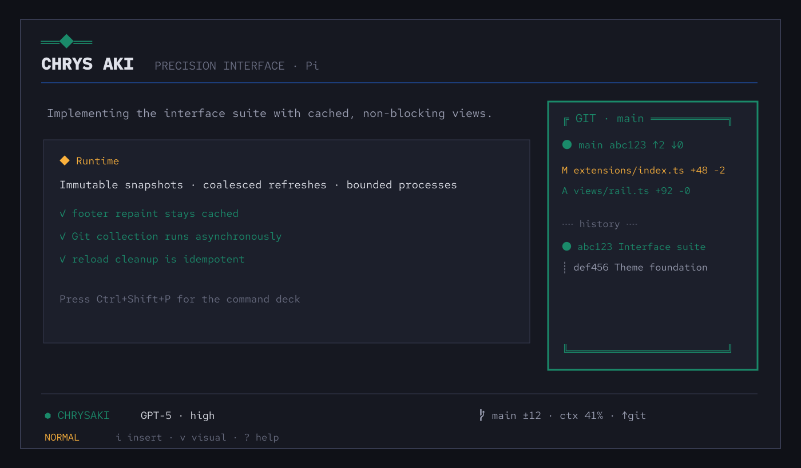

# chrysaki-pi

A responsive Chrysaki Precision interface suite for [Pi](https://github.com/earendil-works/pi-mono). It combines the complete Chrysaki theme with cached telemetry, a width-aware context rail, mini Git visuals, a fuzzy command deck, and guided Practical Vim editing.



## Install

```bash
pi install git:github.com/Kiriketsuki/chrysaki-pi@v1.2.12
```

Select `chrysaki` in `/settings` or set:

```json
{ "theme": "chrysaki" }
```

The package pins [`chrysaki-core` v1.0.0](https://github.com/Kiriketsuki/chrysaki-core/releases/tag/v1.0.0). Installation does not modify tmux or other dotfiles.

## Interface

For the intended docked layout, set **TUI mode** to `fullscreen` in Pi's `/settings` (or launch with `pi --tui-mode fullscreen`). Pi owns this host setting; extensions cannot change it programmatically.


- **Responsive footer:** one cached line in narrow tmux panes; a four-line telemetry deck at wide widths with model, thinking, 5-hour/7-day limits, context, token usage, cache usage, cost, branch, divergence, numstat, and changed files.
- **Context rail:** right-anchored overlay at 120 columns and above. Automatic promotion never overrides a manual pin or hide choice.
- **Mini Git:** read-only branch, status, numstat, and bounded `● ┆ ╌` history with a sharp Chrysaki border. Focus with `Ctrl+Shift+G`, hide with `Ctrl+Shift+H`, move with `Alt+Arrows`, resize with `Alt+Shift+Arrows`, and return to the editor with `Esc`. Git failures preserve the last snapshot and never disable core UI.
- **Rapid scroll:** in fullscreen mode, hold the middle mouse button and drag above or below the anchor point to scroll the transcript at distance-sensitive speed.
- **Command deck:** press `Ctrl+Shift+K` or run `/chrysaki-deck` (`Ctrl+Shift+P` remains available where the terminal does not reserve it). Entries, availability, help, and handlers derive from one registry.
- **Practical Vim:** optional and disabled by default. When enabled it starts in Insert mode; Escape enters Normal and `v` enters Visual.
- **Minimal motion:** a static Chrysaki jewel is the default working indicator. The Deep Work preset uses a restrained pulse.

## Commands

| Command | Purpose |
|:--|:--|
| `/chrysaki-deck` | Open the fuzzy command deck |
| `/chrysaki-rail [auto\|pin\|hide\|git\|context]` | Control or promote the rail |
| `/chrysaki-git [show\|focus\|hide\|toggle]` | Show, focus, collapse, or toggle the Git panel |
| `/chrysaki-preset [focused\|deep-work\|minimal]` | Apply thinking, tools, density, rail, and indicator policy |
| `/chrysaki-settings` | Persist package settings after explicit user changes |
| `/chrysaki-help` | Show registry-generated command help |
| `/chrysaki-debug` | Benchmark cached footer rendering and show resource counts |

Package prompts: `/chrysaki-review` and `/chrysaki-plan`.

## Interactive workers

`worker_run` delegates through interactive Pi, Claude, or Codex sessions inside
tmux and Bubblewrap. `worker_spawn`, `worker_wait`, `worker_status`,
`worker_send`, `worker_reveal`, and `worker_cancel` manage the lifecycle.
`worker_preflight` checks local routing and confinement without launching jobs;
it does not verify provider billing or connectivity.

- Pi workers inherit the invoking session's model. An explicit
  `adapters.pi.model` in `~/.pi/agent/chrysaki-workers.json` takes precedence.
- Read workers cannot modify the source checkout. Write workers use separate Git
  worktrees; dirty work is retained for integration rather than deleted.
- `worker_send` steers active jobs. Completed jobs are immutable; start a new job
  for further work.
- Cancellation and timeouts stop the owned sandbox, including tool subprocesses.
  Captured diagnostics and mailbox files remain until grace cleanup, but the
  cancelled tmux pane is closed.
- Successful results require `result.md` and valid terminal `status.json`.
  Terminal output is diagnostic only.

See [live verification and reproduction commands](docs/testing/workers-live-smoke.md).
Updating the package does not replace code already loaded in Pi; restart Pi
before relying on the new worker runtime.

## Practical Vim subset

- Modes: Insert, Normal, Visual
- Motions: `h j k l`, `w b e`, `0 $`, `gg G`, numeric counts
- Operators: `d c y`, doubled line operators (`dd`, `cc`, `yy`), `x`, `p`, `u`
- Text objects: `iw`, `aw` (`ciw`, `daw`, and equivalents)
- Search: `/query`, Enter, then `n`
- Visual: `v`, extend with motions, apply `d`, `c`, or `y`

Pi application and control shortcuts are delegated to `CustomEditor`; the Vim layer consumes only its supported printable commands and Escape mode transitions.

## Settings

Settings are stored in `~/.pi/agent/chrysaki-pi.json` only after a user changes them through `/chrysaki-settings`:

- rail threshold (default `120`)
- auto-promotion
- minimal/off motion
- Git module visibility
- Practical Vim enabled/start mode (disabled by default)
- compact/comfortable density

## Optional tmux forwarding

See [`adapters/tmux/README.md`](adapters/tmux/README.md). The opt-in `Ctrl+Space, p` binding forwards the deck shortcut while preserving the existing `Ctrl+Space, Space` tmux palette. The adapter is never installed automatically.

## Runtime safety

Rendering reads immutable in-memory snapshots only. Filesystem access, JSON settings parsing, and Git processes run outside `render()`. Git output is capped, refreshes coalesce, failures back off, timeouts kill detached process groups, and shutdown/reload/session replacement disposes collectors, timers, subscriptions, overlays, and child processes idempotently.

## Remove or roll back

```bash
pi remove git:github.com/Kiriketsuki/chrysaki-pi
```

To roll back, reinstall `@v1.0.0` for the theme-only release. Removal does not alter unrelated settings or dotfiles.

## Development

```bash
npm ci
npm run check
```

`themes/chrysaki.json` is generated and committed. Core palette changes belong in `chrysaki-core`; Pi-specific mappings and behavior belong here.
